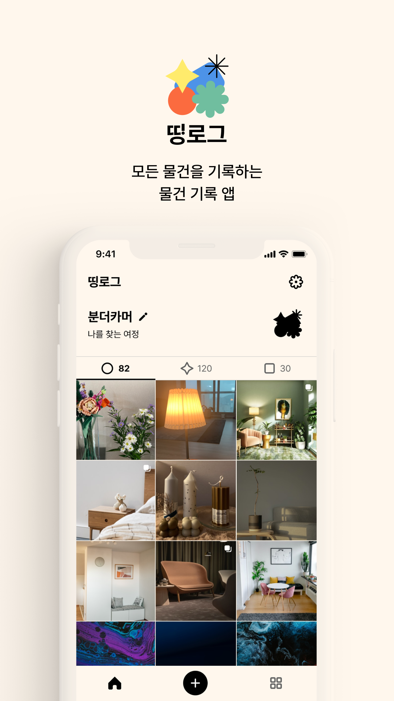
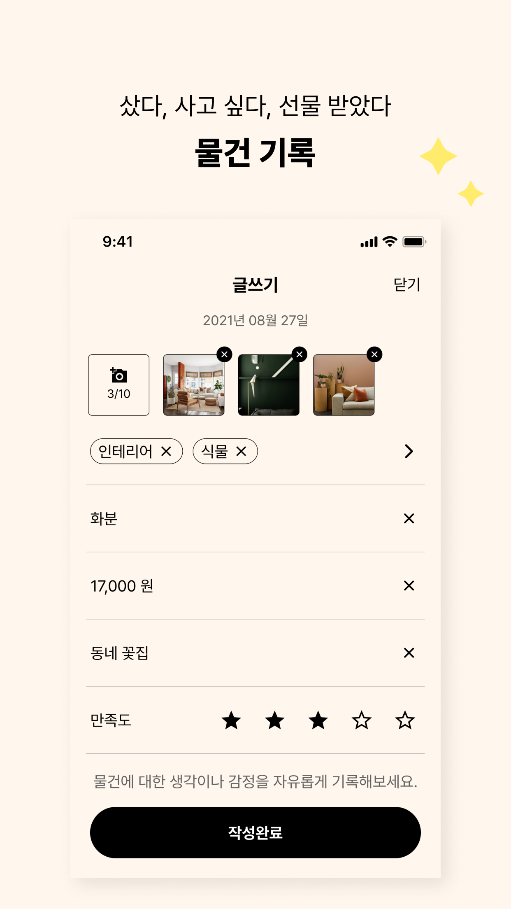
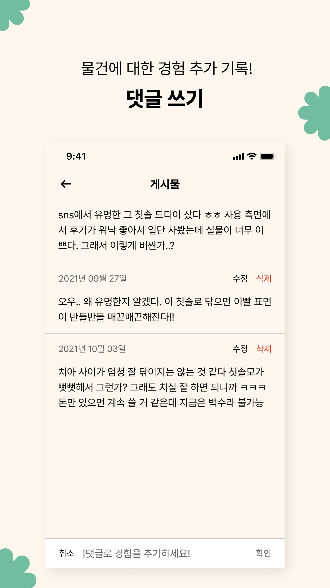
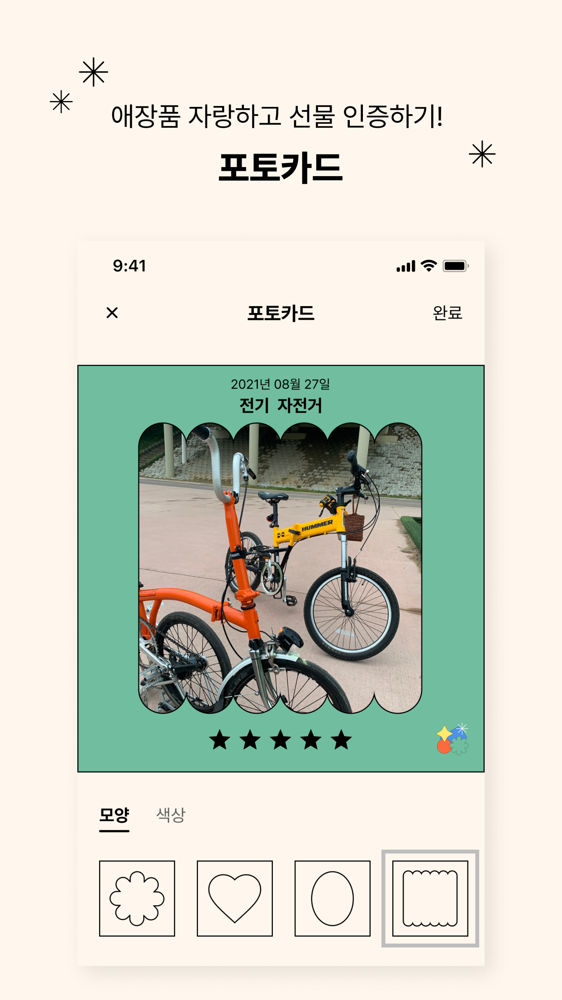
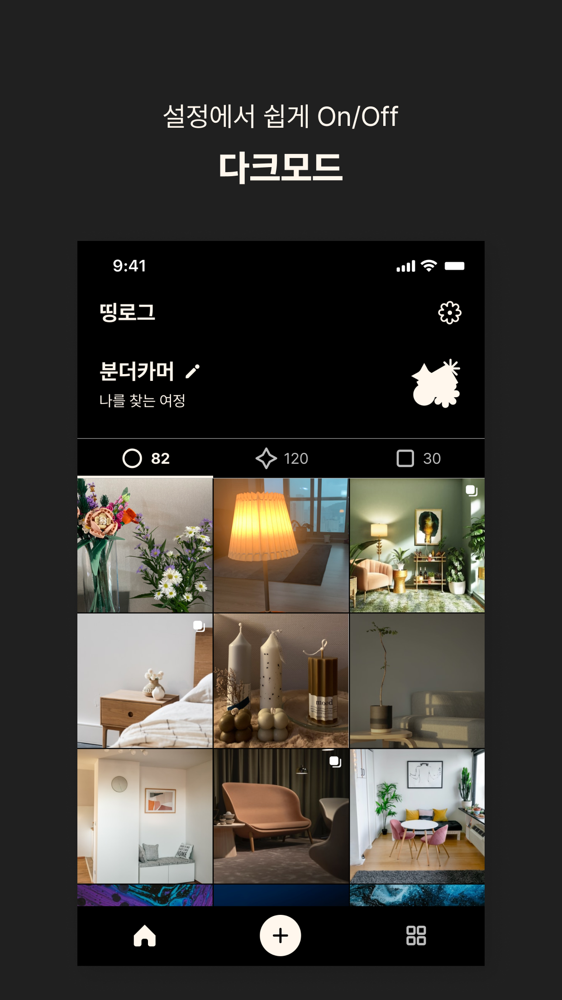

# 띵로그

> 나의 모든 물건들을 기록해 보세요.



<a href="https://apps.apple.com/kr/app/%EB%9D%B5%EB%A1%9C%EA%B7%B8/id1586982199"></a>

## Contents

  - [Requirements](#requirements)
  - [Library](#library)
  - [Commit Convention](#️commit-convention)
  - [Contributors](#contributors)

## Requirements

- Swift 5
- iOS 13+
- Xcode 12

## Library 
- `RxSwift`
- `SwiftGen` 
- `SwiftLint` 
- `Fastlane` 
- `Lottie`
- `FirebaseCrashlytics`
- `FirebaseAnalyticsWithoutAdIdSupport`
- `FirebasePerformance`

> Library Manage 
- `Carthage`
- `SPM`

## Commit Convention
- 기본 구조 
```
[#Issue-Number] <Type>: <Message>
```
- 간단한 커밋 
```
[#1] feat: 기능 추가
```
- 부가적인 설명이 필요한 커밋 
```
[#1] feat: 기능 추가
- 작업1
- 작업 2
```

- `feat`: 기능
- `fix`: 버그 수정
- `env`: 환경 변수 또는 프로젝트 환경
- `ref`: 리팩토링
- `style`: 스타일(코드 형식, 세미콜론 추가: 비즈니스 로직에 변경 없음)
- `docs`: 문서 (문서 추가, 수정, 삭제)
- `test`: 테스트(테스트 코드 추가, 수정, 삭제: 비즈니스 로직에 변경 없음)
- `chore`: 기타 변경사항 (빌드 스크립트 수정 등)


## Contributors

<a href="https://github.com/thinglog/thinglog/graphs/contributors">
  
</a>